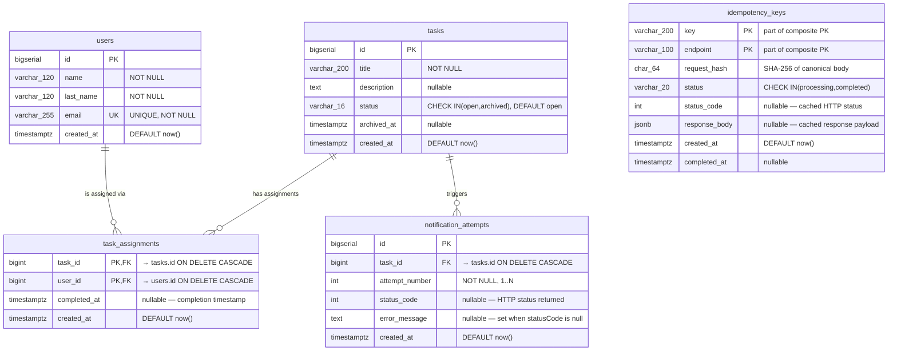

# UML — Esquema de base de datos

Modelo entidad-relación de PostgreSQL. Todas las PKs son `BIGSERIAL`,
todos los timestamps `TIMESTAMPTZ`.

> `idempotency_keys` no tiene FKs a las otras tablas — es infraestructura
> transversal que sirve a cualquier endpoint POST.

## Índices

| Tabla | Índice | Tipo | Motivo |
|---|---|---|---|
| `users` | `ux_users_email` | UNIQUE | Rechazar duplicados en `POST /users` |
| `tasks` | `ix_tasks_status` | BTREE | Filtro `GET /tasks?status=` |
| `task_assignments` | PK `(task_id, user_id)` | BTREE | Deduplicación automática en `assign` |
| `task_assignments` | `ix_task_assignments_user` | BTREE | Reverse lookup por usuario |
| `task_assignments` | `ix_task_assignments_task_pending` | Partial `WHERE completed_at IS NULL` | Contar pending por task rápido |
| `task_assignments` | `ix_task_assignments_user_pending` | Partial `WHERE completed_at IS NULL` | `GET /users` pendingTaskIds |
| `notification_attempts` | `ix_notification_attempts_task` | BTREE | `GET /tasks/:id/notifications` |
| `idempotency_keys` | PK `(key, endpoint)` | BTREE | Serialización de concurrent claims |
| `idempotency_keys` | `ix_idempotency_keys_created_at` | BTREE | Futuro TTL cleanup job |

## Constraints de integridad

- `tasks.status` CHECK IN `('open', 'archived')`
- `idempotency_keys.status` CHECK IN `('processing', 'completed')`
- `users.email` UNIQUE
- `task_assignments.task_id` / `user_id` con ON DELETE CASCADE (borrar user/task limpia sus assignments)
- `notification_attempts.task_id` con ON DELETE CASCADE

## Migraciones versionadas

Ubicadas en [`src/database/migrations/`](../src/database/migrations/):

1. `1735260000000-InitialSchema` — `users`, `tasks`, `task_assignments` + índices base
2. `1735260060000-AddIdempotencyAndNotifications` — `notification_attempts`, `idempotency_keys` + índice `user_pending` (audit M7)

Correr con `npm run migration:run`. En producción se ejecutan automáticamente al arranque via `AUTO_RUN_MIGRATIONS=true`.
